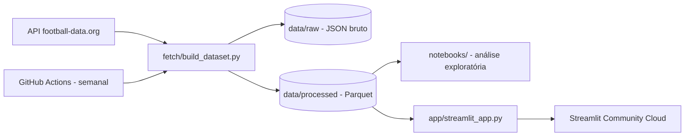

# Análise de Futebol Europeu

[](https://github.com/EduardoFernandes7/analise-futebol-europeu/actions/workflows/refresh-data.yml)
[](LICENSE)

Análise exploratória e dashboard interativo comparando as 5 grandes ligas europeias de futebol — Premier League, La Liga, Bundesliga, Serie A e Ligue 1 — na temporada 2025/26: vantagem de jogar em casa, poder ofensivo, disputa pelo título e times que superaram ou decepcionaram as expectativas.

**[Ver o dashboard ao vivo →](https://eduardofernandes7-analise-futebol-europ-appstreamlit-app-8mwax4.streamlit.app/)**

<!-- TODO: depois do deploy no Streamlit Community Cloud, adicionar um screenshot em docs/dashboard-screenshot.png e referenciar aqui com  -->

## O que este projeto mostra

- **Storytelling analítico com dados reais**: um notebook (`notebooks/01_analise_exploratoria.ipynb`) que parte de perguntas concretas — não só descreve os dados, investiga hipóteses.
- **Dashboard interativo** em Streamlit com filtros por liga e por time, reaproveitando as mesmas funções de análise do notebook (sem duplicar lógica entre os dois).
- **Coleta de dados automatizada e atualizada sozinha** via GitHub Actions: um job semanal busca os resultados mais recentes na API e commita o dataset atualizado — o dashboard nunca fica desatualizado por muito tempo.
- **Comparação entre ligas**, não só análise de uma liga isolada: vantagem de mando de campo, média de gols e disputa pelo título lado a lado.

## Arquitetura



## Stack

Python · pandas · Parquet · Plotly · Streamlit · Jupyter · GitHub Actions

## Fonte de dados

| Fonte | Dados | Observação |
|---|---|---|
| [football-data.org](https://www.football-data.org/) (API v4) | Partidas, resultados e classificação das 5 grandes ligas europeias | Tier gratuito, precisa de cadastro + chave de API; 10 requisições/minuto; cobre fixtures/resultados/classificação, sem estatísticas de jogador |

**Nota**: o tier gratuito da API não inclui placares em tempo real (há um pequeno atraso) nem estatísticas avançadas (posse de bola, finalizações, etc.) — a análise fica restrita ao que dá pra extrair de resultado, gols e classificação.

## Decisões técnicas

- **pandas + Parquet em vez de DuckDB/dbt**: este é o projeto de *Data Analysis* do portfólio (o projeto de Data Engineering, [pipeline-macro-mercado-brasil](https://github.com/EduardoFernandes7/pipeline-macro-mercado-brasil), já cobre orquestração com camadas bronze/silver/gold e testes automatizados). Aqui a ênfase é a análise em si, então a camada de dados fica deliberadamente mais simples.
- **Lógica de análise compartilhada** (`analysis/metrics.py`) entre o notebook e o dashboard Streamlit, para não duplicar as mesmas contas em dois lugares.
- **Rate limit da API respeitado explicitamente**: o tier gratuito permite 10 requisições/minuto; o client em `fetch/football_data_api.py` espaça as chamadas e tenta de novo com espera maior se ainda assim receber HTTP 429.
- **Atualização semanal via GitHub Actions**: o job roda `fetch/build_dataset.py` toda segunda-feira e só commita se o dataset processado realmente mudou — mesmo padrão de "pipeline vivo" usado no projeto 1, adaptado para não precisar de um heartbeat separado (o próprio commit no `data/processed` já serve de sinal de atividade).
- **Temporada 2025/26 como base**: em agosto/2026, a temporada 2026/27 mal tinha começado, então a análise usa a última temporada completa disponível para ter uma amostra de dados relevante desde o primeiro deploy.

## Estrutura do repositório

```
fetch/       -> client da API + script que gera o dataset (data/raw -> data/processed)
analysis/    -> funções de análise reaproveitadas pelo notebook e pelo dashboard
notebooks/   -> análise exploratória (Jupyter)
app/         -> dashboard interativo (Streamlit)
data/        -> dados brutos (não versionados) e processados (Parquet, versionados)
.github/     -> workflow de atualização semanal dos dados
```

## Como rodar localmente

```bash
python -m venv .venv
.venv\Scripts\activate          # Windows
pip install -r requirements.txt

# copie .env.example para .env e preencha FOOTBALL_DATA_API_KEY
# (cadastro gratuito em https://www.football-data.org/client/register)

python -m fetch.build_dataset    # busca os dados e gera data/processed/*.parquet
jupyter notebook notebooks/01_analise_exploratoria.ipynb
streamlit run app/streamlit_app.py
```

## Licença

MIT — veja [LICENSE](LICENSE).
